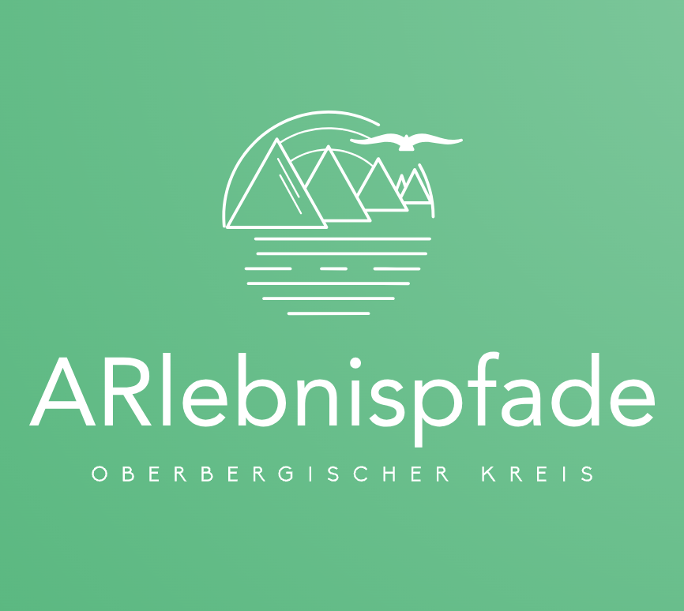
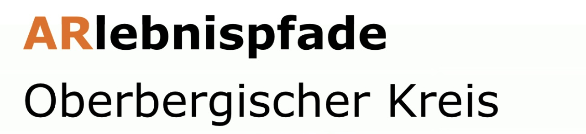
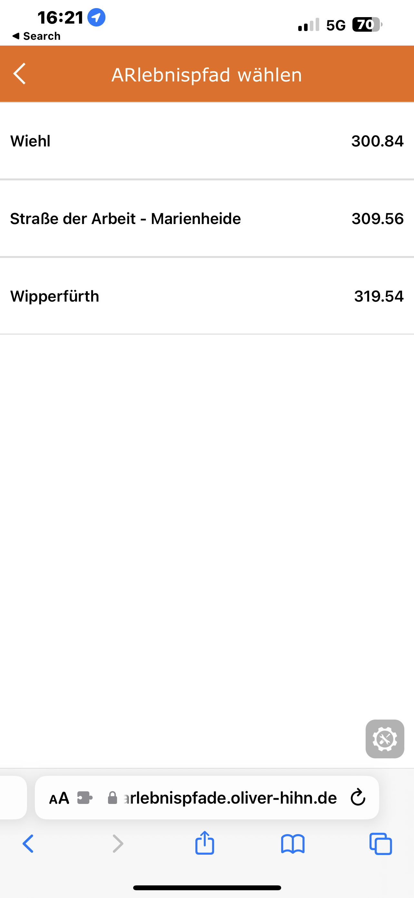
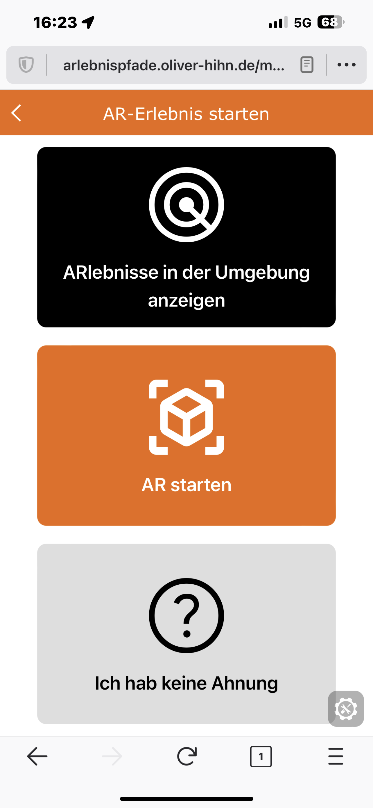

<a name="readme-top"></a>

[![Forks][forks-shield]][forks-url]
[![Stargazers][stars-shield]][stars-url]
[![Issues][issues-shield]][issues-url]
[![MIT License][license-shield]][license-url]

<!-- PROJECT LOGO -->
<br />
<div align="center">
  <a href="https://github.com/mi-classroom/mi-web-technologien-beiboot-ss2023-oliverhihn">
    
  </a>

<h3 align="center">ARlebnispfade</h3>

  <p align="center">
    Oberbergischer Kreis
    <br />
    <a href="https://github.com/mi-classroom/mi-web-technologien-beiboot-ss2023-oliverhihn"><strong>Explore the docs »</strong></a>
    <br />
    <br />
    <a href="https://arlebnispfade.oliver-hihn.de">View Demo</a>
    ·
    <a href="https://github.com/mi-classroom/mi-web-technologien-beiboot-ss2023-oliverhihn/issues">Report Bug</a>
    ·
    <a href="https://github.com/mi-classroom/mi-web-technologien-beiboot-ss2023-oliverhihn/issues">Request Feature</a>
  </p>
</div>


<!-- TABLE OF CONTENTS -->
<details>
  <summary>Table of Contents</summary>
  <ol>
    <li>
      <a href="#about-the-project">About The Project</a>
      <ul>
        <li><a href="#built-with">Built With</a></li>
      </ul>
    </li>
    <li>
      <a href="#getting-started">Getting Started</a>
      <ul>
        <li><a href="#prerequisites">Prerequisites</a></li>
        <li><a href="#installation">Installation</a></li>
      </ul>
    </li>
    <li><a href="#usage">Usage</a></li>
    <li><a href="#license">License</a></li>
    <li><a href="#contact">Contact</a></li>
    <li><a href="#acknowledgments">Acknowledgments</a></li>
  </ol>
</details>


<!-- ABOUT THE PROJECT -->
## About The Project


Dieses Projekt ist ein Beibootprojekt des WebTech Moduls der TH-Köln. Ziel ist es, eine Demoanwendung für eine Augemnted Reality Web-App zu erstellen und auf dem Weg dorthin, zu dokumentieren und natürlich zu lernen.

<p align="right">(<a href="#readme-top">zurück zum Anfang</a>)</p>


### Built With

* [![Vue][Vue.js]][Vue-url]

<p align="right">(<a href="#readme-top">zurück zum Anfang</a>)</p>


<!-- GETTING STARTED -->
## Getting Started

Im folgenden wird beschrieben wie die Demoanwendung gehostet und getestet bwerden kann.

### Prerequisites

Nach dem clonen des Branches `demoanwendung`:
* npm
  ```sh
  cd mi-web-technologien-beiboot-ss2023-oliverhihn
  npm install
  ```

### Installation

1. Build
   ```sh
   docker compose build --no-cache
   ```
2. ngrok API anpassen in `docker-compose.yml`
   ```yaml
    services:
      arlebnispfade:
        container_name: arlebnispfade
        build:
          context: .
          args:
            - AUTH_TOKEN=<your-token>
   ```
3. Deployment (local)
   ```bash
   docker compose up -d
   ```

<p align="right">(<a href="#readme-top">zurück zum Anfang</a>)</p>


<!-- USAGE EXAMPLES -->
## Usage

Nach dem deployment wird in dem Terminal-Fenster die jeweilige ngrok-URL ausgegeben. Diese einfach in ein Browser-Fenster einfürgen und die App bedienen.

> Note: Es ist wichtig, dass bei der Verwendung der AR-Features ein Kompatibler Browser genutzt wird. Aktuell ist das für iOS der WebXR von Mozilla. Safari unterstützt XR leider noch nicht.

<div align="center">
<p float="center">
  
  
  
  
  
</p>
</div>

Durch das Scannen der unten stehenden QR-Codes werden die Verschiedenen Anwendungen geladen.

<div align="center">
<br>
<hr>
<br>
  
  <p> connect markers with cylindar </p>
<br>
<hr>
<br><br>
  
  <p> image tracking </p>
<br>
<hr>
<br><br>
  
  <p> location based with audio </p>
<br>
<hr>
<br><br>
  
  <p> location based </p>
<br>
<hr>
<br><br>
  
  <p> marker based with audio </p>
<br>
<hr>
<br><br>
  
  <p> simple objects </p>
</div>

<p align="right">(<a href="#readme-top">zurück zum Anfang</a>)</p>

<!-- LICENSE -->
## License

Distributed under the MIT License. See `LICENSE` for more information.

<p align="right">(<a href="#readme-top">zurück zum Anfang</a>)</p>


<!-- CONTACT -->
## Contact

Oliver Hihn - mark_oliver.hihn@smail.th-koeln.de

Project Link: [https://github.com/mi-classroom/mi-web-technologien-beiboot-ss2023-oliverhihn](https://github.com/mi-classroom/mi-web-technologien-beiboot-ss2023-oliverhihn)

<p align="right">(<a href="#readme-top">zurück zum Anfang</a>)</p>

<!-- MARKDOWN LINKS & IMAGES -->
<!-- https://www.markdownguide.org/basic-syntax/#reference-style-links -->
[contributors-shield]: https://img.shields.io/github/contributors/mi-classroom/mi-web-technologien-beiboot-ss2023-oliverhihn.svg?style=for-the-badge
[contributors-url]: https://github.com/mi-classroom/mi-web-technologien-beiboot-ss2023-oliverhihn/graphs/contributors
[forks-shield]: https://img.shields.io/github/forks/mi-classroom/mi-web-technologien-beiboot-ss2023-oliverhihn.svg?style=for-the-badge
[forks-url]: https://github.com/mi-classroom/mi-web-technologien-beiboot-ss2023-oliverhihn/network/members
[stars-shield]: https://img.shields.io/github/stars/mi-classroom/mi-web-technologien-beiboot-ss2023-oliverhihn.svg?style=for-the-badge
[stars-url]: https://github.com/mi-classroom/mi-web-technologien-beiboot-ss2023-oliverhihn/stargazers
[issues-shield]: https://img.shields.io/github/issues/mi-classroom/mi-web-technologien-beiboot-ss2023-oliverhihn.svg?style=for-the-badge
[issues-url]: https://github.com/mi-classroom/mi-web-technologien-beiboot-ss2023-oliverhihn/issues
[license-shield]: https://img.shields.io/github/license/mi-classroom/mi-web-technologien-beiboot-ss2023-oliverhihn.svg?style=for-the-badge
[license-url]: https://github.com/mi-classroom/mi-web-technologien-beiboot-ss2023-oliverhihn/blob/master/LICENSE
[linkedin-shield]: https://img.shields.io/badge/-LinkedIn-black.svg?style=for-the-badge&logo=linkedin&colorB=555
[linkedin-url]: https://linkedin.com/in/linkedin_username
[product-screenshot]: images/screenshot.png
[Next.js]: https://img.shields.io/badge/next.js-000000?style=for-the-badge&logo=nextdotjs&logoColor=white
[Next-url]: https://nextjs.org/
[React.js]: https://img.shields.io/badge/React-20232A?style=for-the-badge&logo=react&logoColor=61DAFB
[React-url]: https://reactjs.org/
[Vue.js]: https://img.shields.io/badge/Vue.js-35495E?style=for-the-badge&logo=vuedotjs&logoColor=4FC08D
[Vue-url]: https://vuejs.org/
[Angular.io]: https://img.shields.io/badge/Angular-DD0031?style=for-the-badge&logo=angular&logoColor=white
[Angular-url]: https://angular.io/
[Svelte.dev]: https://img.shields.io/badge/Svelte-4A4A55?style=for-the-badge&logo=svelte&logoColor=FF3E00
[Svelte-url]: https://svelte.dev/
[Laravel.com]: https://img.shields.io/badge/Laravel-FF2D20?style=for-the-badge&logo=laravel&logoColor=white
[Laravel-url]: https://laravel.com
[Bootstrap.com]: https://img.shields.io/badge/Bootstrap-563D7C?style=for-the-badge&logo=bootstrap&logoColor=white
[Bootstrap-url]: https://getbootstrap.com
[JQuery.com]: https://img.shields.io/badge/jQuery-0769AD?style=for-the-badge&logo=jquery&logoColor=white
[JQuery-url]: https://jquery.com